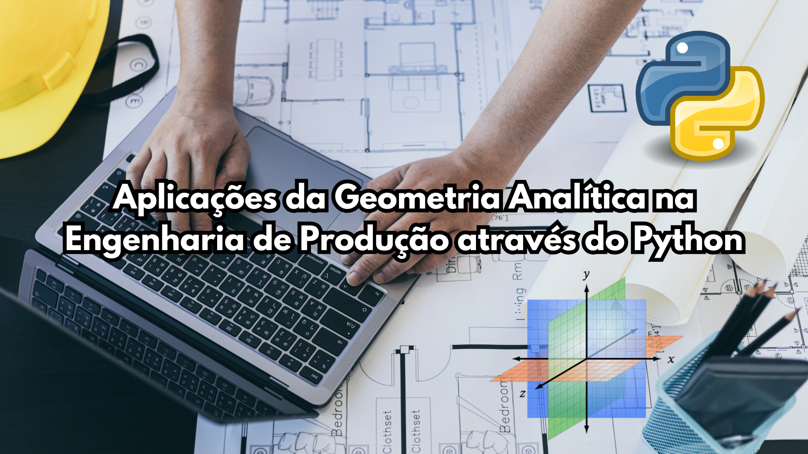

# PyGA-EP

<h2>Aplicações da Geometria Analítica na Engenharia de Produção</h2>

Este produto educacional constitui um dos resultados do projeto Ações em prol das disciplinas de Geometria Analítica e Álgebra Linear, executado entre 08/2024 e 12/2024 com o apoio da PROGRAD/UFAL, por meio do Edital PROGRAD Nº 15/2024, sob a supervisão do Prof. Dr. Marcelo Pires.
